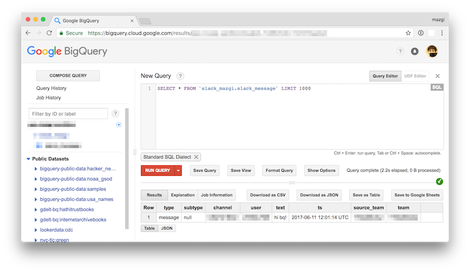

# slack2bq

## Prepare

```shellsession
$ echo "export SLACK_TOKEN='YOUR_SLACK_TOKEN'" > secret.sh
```

```shellsession
$ bq mk gcp-mazgi-sandbox:slack_mazgi
$ bq mk --table gcp-mazgi-sandbox:slack_mazgi.slack_message schema/slack_message.json
```

[Create a GCP serice account](https://console.cloud.google.com/iam-admin/serviceaccounts/project) and store json key into `secret/` directory.

## Execute

```shellsession
$ bundle
$ . ./secret.sh
$ bundle exec fluentd --config etc/fluentd/slack-logs.conf --use-v1-config -vv
```

### Example

1. Post a message on slack


2. Query on BQ


